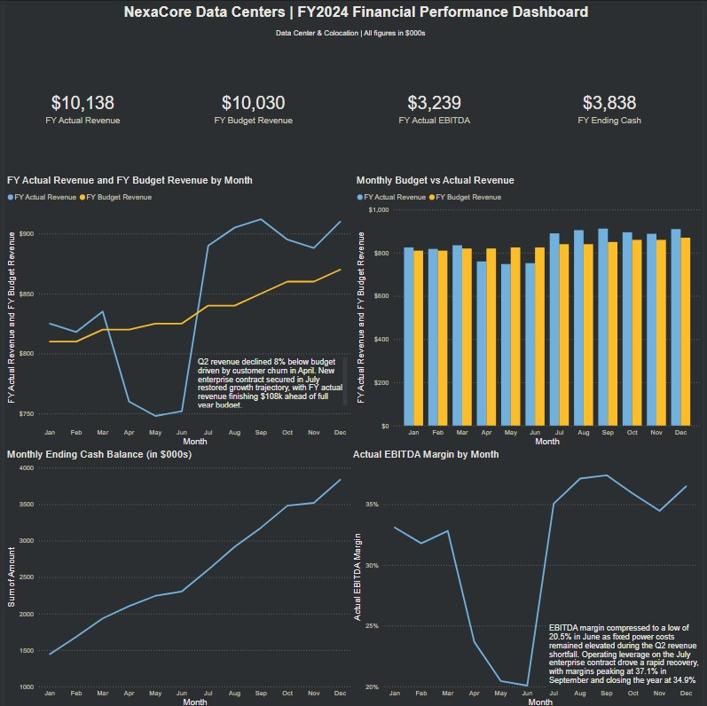

An example financial dashboard made in power BI for my finance portfolio:

Dashboard Preview:

Interactive financial performance dashboard built in Power BI for a 
fictional data center/colocation company. Covers full year FY2024 
across revenue, EBITDA, cash flow and margin analysis.

Context:
NexaCore experienced customer churn in Q2 that drove revenue 8% below 
budget and compressed EBITDA margins to a low of 20.5% in June. A new 
enterprise contract secured in July restored growth trajectory, with 
FY actual revenue closing $108K favorable to plan.

Dashboard Features:
- KPI cards: FY Actual Revenue, Budget Revenue, EBITDA, Ending Cash
- Actual vs Budget revenue line chart (12 months)
- Monthly Budget vs Actual clustered bar chart
- Ending cash balance trend with capex impact
- EBITDA margin compression and recovery analysis
- Analyst commentary on key variances

- Power BI Desktop
- Microsoft Excel

An example 3 statement model analysis example:

Three statement financial model built in Excel for a fictional seed stage cybersecurity SaaS company. Covers FY2022 – FY2024 historical actuals and FY2025E – FY2026E forecast across a full P&L, balance sheet, and cash flow statement.

Context:
Vaultline Security experienced customer churn and rising costs through FY2022 – FY2024 while investing heavily in product and sales. The forecast models an efficiency recovery driven by a $3.5M seed raise, with net losses narrowing from ($926K) in FY2024 to ($386K) by FY2026 as gross margins expand and operating leverage improves.

Model Features:
-Assumptions tab: ARR waterfall, headcount planning, unit economics, and margin drivers

-Full income statement: revenue build through net income across 5 years

-Balance sheet: assets, liabilities, and equity with forecast period

-Cash flow statement: indirect method across operating, investing, and financing activities

-SaaS KPI summary: MRR, ARR growth, churn, LTV:CAC, Rule of 40, and runway

